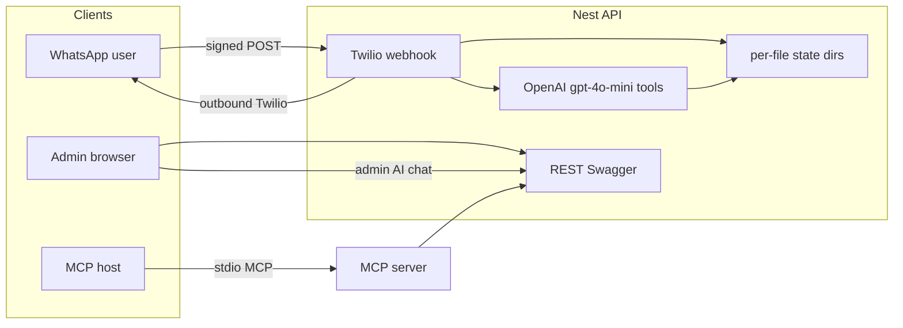

# AltaRise Beauty Salon – booking demo plan

## Goals (from your brief)

- **Public page**: How clients connect (reuse `[qr_code.svg](qr_code.svg)`), WhatsApp sandbox instructions.
- **Admin**: HTTP login `altarise` / `Password123!` (demo only; implement via env-backed constant so it is not hardcoded in source if you prefer).
- **Dashboard**: Current-month **calendar** with bookings; **WhatsApp** UI (conversation list + thread); enforce **24h WhatsApp session** for free-form replies vs **Content API template** (e.g. appointment reminder with `contentSid` + `contentVariables` from env).
- **Separate admin “AI” chat**: Direct **OpenAI** chat with **tools** that list/create bookings (same business logic as REST).
- **API**: Bookings CRUD + list for month; **Swagger** UI at `/docs`.
- **Persistence**: **Per-file JSON** under `state/` (no DB): **one file per chat**, **one file per booking**; aggregate views (e.g. all bookings for the month) by **reading the bookings directory**; **cancel = delete** the booking file.
- **Stack**: **NestJS** (API + Twilio webhook), **Vue 3 + Vite** (frontend), **OpenAI** SDK with function/tool calling, model `**gpt-4o-mini`**. **MCP**: small **stdio** MCP server that calls the Nest API (single source of truth), not duplicate booking logic.
- **Scope**: **Internal demo** (not open to the public); still keep secrets in env and avoid committing credentials.

## Repository layout (proposed)

- `[api/](api/)` – NestJS application (main entry, modules below).
- `[web/](web/)` – Vue 3 + Vite + Vue Router (and optionally Pinia for auth token).
- `[state/](state/)` – Directory-based JSON store (see below); real data local only; gitignore as appropriate.
- `[mcp/](mcp/)` – Minimal MCP server (Node + `@modelcontextprotocol/sdk`) that exposes tools wrapping HTTP calls to Nest.
- **Legacy**: Retire `[server.js](server.js)` and root `[send-whatsapp.js](send-whatsapp.js)` once Nest exposes webhook + optional CLI script under `api/` or `scripts/` (or keep one thin script that calls Nest – your choice during implementation).

## Data model (per-file JSON)

**Principle**: Chats and bookings are **not** stored in single large arrays. Each entity has its own file; listing “all bookings” = **read all `*.json` files** in the bookings folder (with stable sorting by `start`).

| Location                                                 | Purpose                                                                                                                                                                                                                            |
| -------------------------------------------------------- | ---------------------------------------------------------------------------------------------------------------------------------------------------------------------------------------------------------------------------------- |
| `state/services.json` (or `state/catalog/services.json`) | Canonical list of services (seed from `[beauty_services.md](beauty_services.md)` once at bootstrap or checked-in static array).                                                                                                    |
| `state/chats/<chatId>.json`                              | **One file per WhatsApp chat** (e.g. `chatId` derived from normalized phone E.164). Contains client identity (`phoneE164`, `name`), `lastInboundAt`, and embedded **message history** (or a `messages[]` array) for the dashboard. |
| `state/bookings/<bookingId>.json`                        | **One file per appointment**: `{ id, clientId, start: ISO8601, services: string[], durationMinutes: 60 }`. **Cancel** = **delete this file**.                                                                                      |

**Overlap rules**: When creating a booking, scan all booking files for the same time window (1h slots, salon-wide single chair for demo) and reject conflicts.

**Writes**: Use **atomic replace per file** (write temp in same dir + rename) when updating a chat or booking file.

Optional: `state/admin-ai-sessions.json` if you persist admin OpenAI threads; for v1, **in-memory** admin chat + optional `threadId` in sessionStorage is enough.

## NestJS modules (concise)

- **ConfigModule** – `TWILIO_`*, `OPENAI_API_KEY`, `TWILIO_WEBHOOK_BASE_URL`, template `TWILIO_CONTENT_SID_`*, demo `ADMIN_USER` / `ADMIN_PASSWORD`, `JWT_SECRET` (or simple signed cookie). `**OPENAI_MODEL=gpt-4o-mini*`* (default for all agent paths).
- **AuthModule** – `POST /auth/login` → JWT; `AuthGuard` on dashboard API routes.
- **BookingsModule** – Service that **reads/writes/deletes** files under `state/bookings/`; **overlap check** across all booking files; DTOs with class-validator; Swagger decorators.
- **ClientsModule / ChatsModule** – Upsert **chat file** by inbound `From`; update `lastInboundAt` on each inbound WhatsApp message.
- **MessagesModule** – Append to the relevant **chat file** (or dedicated structure inside it); list threads by scanning `state/chats/`.
- **TwilioModule** – Outbound: regular `messages.create` when **within 24h** of `lastInboundAt`; otherwise only **Content API** (`contentSid`, `contentVariables`). Inbound: `**validateRequest` required** (see below).
- **OpenAiModule** – Shared client configured for `**gpt-4o-mini`**; **two flows**:
  1. **WhatsApp inbound**: after persisting message + chat file, call OpenAI with system prompt (salon + services + booking rules) + **tools** implemented as calls to `BookingService` / chat services (same as REST).
  2. **Tool definitions**: e.g. `list_bookings_month`, `create_booking` – implemented by reading the bookings directory / writing a new booking file; return tool results; send final assistant text to Twilio if session rules allow.

**Swagger**: `@nestjs/swagger` + `SwaggerModule.setup('docs', app, document)` so UI is at `/docs`. Global prefix e.g. `api` optional; if used, Swagger path stays `/docs` at root.

**CORS**: Enable for Vite dev origin (`http://localhost:5173`).

## Twilio webhook signature (required)

- **Always validate** `X-Twilio-Signature` with `twilio.validateRequest(authToken, signature, fullUrl, params)` before handling the body.
- `**fullUrl`** must be the exact URL Twilio POSTs to. With Nest, use the same pattern as `[server.js](server.js)`: `fullUrl =` ${TWILIO_WEBHOOK_BASE_URL.replace(/$/, '')}${req.originalUrl}`` (include query string if Twilio sends any).
- **Current demo tunnel** (example; keep in `.env`, rotate when ngrok restarts):
  - `TWILIO_WEBHOOK_BASE_URL=https://2dd2-83-223-225-67.ngrok-free.app`
  - Webhook path: `/webhook/whatsapp` → full URL `https://2dd2-83-223-225-67.ngrok-free.app/webhook/whatsapp`

If the tunnel URL changes, update `.env` only; never hardcode in code.

## Vue app (two main UX surfaces)

1. `**/` (public)** – Title, short copy, embed or ``, steps to join sandbox / message the number.
2. `**/login`** – Form → `POST /auth/login` → store JWT.
3. `**/dashboard`** (protected route) – Layout:
  - **Top**: Month calendar fed by `GET /bookings?from=&to=` or month query (API aggregates from booking files).
  - **Main split**: Left = conversation list (scan chat files / API); Right = message thread + composer.
    - If `now - lastInboundAt > 24h`: disable free-text send; show banner; **“Send reminder template”** button → `POST` endpoint that sends Content API message with variables from selected booking / next appointment.
  - **Admin AI panel** (drawer or second column): Chat UI → `POST /admin/ai/chat` that proxies OpenAI with the same tools server-side (no keys in browser), model `**gpt-4o-mini`**.

Polling (`setInterval` 3–5s) is acceptable for the demo; SSE can be a later improvement.

## MCP server (demo scope)

- Separate small Node process under `[mcp/](mcp/)` using **MCP SDK**: tools `list_bookings` / `create_booking` that **HTTP call** Nest with a shared `**MCP_API_KEY`** (or JWT from a service account) so business rules stay in Nest only.
- Document in Swagger README or a short comment in `mcp/README` how to run it with Cursor/other MCP hosts.

## OpenAI Chat Completions API and MCP (can we “add MCP” to API calls?)

**Short answer:** The **OpenAI HTTP API does not embed or connect to an MCP server** the way Cursor does. You pass `**tools`** (JSON Schema) on each request; the model returns `tool_calls`; **your code** executes them.

**What we do in this project:**

- **Single source of truth**: All booking/chat rules live in **Nest** (`BookingService`, etc.).
- **OpenAI path (WhatsApp + admin AI)**: Register **OpenAI-native tools** (same *capabilities* as MCP: list bookings for month, create booking, …) whose **handlers call Nest services directly** (in-process). No need to spawn the MCP process from Nest for each message.
- **MCP path (Cursor, Claude Desktop, etc.)**: The **stdio MCP server** calls **Nest REST** with `MCP_API_KEY`. Same behavior, different wire protocol.

So the MCP server is **not plugged inside** `chat.completions.create()`. Instead, **MCP and OpenAI share one backend**: parallel “clients” of the same API/services. Optionally, define **one small shared module** (e.g. `tool-definitions.ts`: names, descriptions, JSON Schema for args) imported by both the OpenAI tool registration and the MCP tool list to avoid drift—still execution stays in Nest (REST or direct service calls).

**Advanced (out of scope for v1):** A generic **MCP client inside Nest** that forwards each OpenAI `tool_call` to `tools/call` on a local MCP process adds latency, process management, and little benefit when Nest already implements the tools.

## Environment / secrets (no credentials in repo)

- All Twilio and OpenAI keys via `.env`. **Do not** embed Account SID / Auth Token / Content SIDs in code – use env vars only.
- `OPENAI_MODEL=gpt-4o-mini` (default).
- Template example mapping: `contentVariables: '{"1":"12/1","2":"3pm"}'` → build from booking `start` in the reminder endpoint.

## Implementation order (phased)

1. **Scaffold** Nest + Vue; implement **per-file** `state/chats` and `state/bookings` with atomic writes; seed services from `[beauty_services.md](beauty_services.md)`.
2. **Bookings + Chats/Messages** REST + Swagger + auth guard (list = directory aggregation).
3. **Twilio webhook** in Nest (migrate from `[server.js](server.js)`); **mandatory signature validation** with `TWILIO_WEBHOOK_BASE_URL`; persist inbound to chat files; outbound + 24h + template branch.
4. **OpenAI** (`gpt-4o-mini`) tool loop for WhatsApp + shared tool implementations.
5. **Vue** pages: public QR, login, dashboard (calendar + WhatsApp + admin AI chat).
6. **MCP** package calling Nest API.
7. Remove or redirect legacy Express `[server.js](server.js)`; update root `package.json` scripts for `api:dev` / `web:dev`.

## Architecture sketch

## Risks / constraints (accepted for this demo)

- **File store (by design)**: Suited for **demo** volume. **One chat file per conversation** and **one booking file per appointment** keeps cancellation **O(1) delete** and avoids monolithic JSON. Use **atomic per-file writes** when updating; concurrent edits to the *same* file remain a small edge case at demo scale.
- **Twilio signature**: **Required** on every webhook; `TWILIO_WEBHOOK_BASE_URL` must stay in sync with the public URL Twilio calls (ngrok URLs change when the tunnel restarts).
- **OpenAI**: All automated paths use `**gpt-4o-mini`**; internal demo only—still protect API keys and admin login, but no need for “production hardening” beyond sensible defaults.
- **Not public-facing**: No expectation of multi-tenant security review; keep the app off the open internet or behind auth/VPN if extended.

