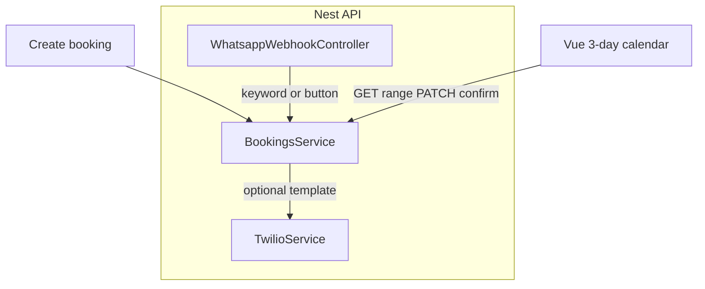

# Follow-up: bookings, calendar, logging, Twilio confirmation

## Root causes found in code

1. **Calendar “empty”** — [`api/src/bookings/bookings.service.ts`](../../api/src/bookings/bookings.service.ts) `listForMonth` uses **UTC** month boundaries (`Date.UTC(...)`), while [`web/src/views/DashboardView.vue`](../../web/src/views/DashboardView.vue) maps bookings using **local** `getFullYear()` / `getMonth()` / `getDate()`. Bookings near month edges or mixed UTC/local semantics will not line up with the grid. Separately, **stored `start` years** (e.g. test data in 2023) will not appear when the UI defaults to the current month/year.
2. **Template reminder “not working”** — [`api/src/chats/chats.controller.ts`](../../api/src/chats/chats.controller.ts) only fills `var1`/`var2` when `b.clientId === id` (chat id). Existing files like [`state/bookings/1852d458-1467-4637-9704-754a8e2280f6.json`](../../state/bookings/1852d458-1467-4637-9704-754a8e2280f6.json) use a **different** `clientId` than the chat file name/id, so the condition fails and the handler returns “Provide bookingId or var1 and var2” without calling Twilio. The Twilio SDK path in [`api/src/twilio/twilio.service.ts`](../../api/src/twilio/twilio.service.ts) maps `contentVariables` to `ContentVariables` (string), which matches the working curl shape; the main bug is likely **logic/association**, not the wire format—still add **logging of Twilio errors** (`RestException`) to verify.

## 1. Booking model and PATCH API

- Extend [`api/src/bookings/booking.types.ts`](../../api/src/bookings/booking.types.ts):
  - **`phoneE164`** (required): canonical client key (e.g. `+4915901600682`), replaces opaque `clientId` for business logic.
  - **`clientName`** (required on create): display + agent requirement.
  - **`confirmed`** (boolean, default `false`).
  - Keep **`id`**, **`start`**, **`services`**, **`durationMinutes`**.
- **Migration (demo)**: on read, if old files only have `clientId`, resolve `phoneE164` from the matching chat file under [`state/chats/`](../../state/chats/) when possible, or require one-time manual fix; new writes use the new shape only.
- Add **`PATCH /bookings/:id`** (JWT-protected, Swagger): partial update for `start`, `services`, `clientName`, `confirmed` — reuse overlap logic on `start` change (exclude self when checking conflicts).
- Update [`api/src/bookings/dto/create-booking.dto.ts`](../../api/src/bookings/dto/create-booking.dto.ts) and add `update-booking.dto.ts` with `class-validator`.
- Align **MCP** [`api/src/mcp/mcp.controller.ts`](../../api/src/mcp/mcp.controller.ts) and **OpenAI tools** [`api/src/tools/booking-tools.ts`](../../api/src/tools/booking-tools.ts): `create_booking` / `update_booking` use **`phoneE164` + `clientName`**; remove or alias `clientId` in tool schemas so the agent cannot drift.

## 2. Three-day booking window (API + agent)

- In **`BookingsService.create` / `update`**: validate `start` falls within **rolling “today” through day+2** in a single chosen timezone (recommend **`Europe/Berlin`** or env `BOOKING_TIMEZONE`, using a small helper or `luxon`/`date-fns-tz`—pick one dependency for clarity).
- Replace or supplement month listing for the agent with **`list_bookings_in_range(fromIso, toIso)`** or dedicated **`list_bookings_next_3_days`** used by tools and prompts.
- Update [`api/src/openai/openai.service.ts`](../../api/src/openai/openai.service.ts) WhatsApp system prompt: **explicit rule** — bookings are **only** allowed for the **next 3 calendar days** (in that timezone); agent must **ask for the client’s name** before creating a booking; tools must pass **`clientName`** and **`phoneE164`** (from context: inbound `From` normalized to E.164).

**Context for tools:** Pass `phoneE164` and display name hints into `replyForWhatsApp` / tool execution (e.g. inject into `systemExtra` or a dedicated tool context object) so `create_booking` does not rely on the model guessing `clientId`.

## 3. Twilio: confirmation template on create + confirm semantics

- After a successful **`create`** (from agent tool path and/or REST): call **`TwilioService.sendTemplate`** to the same user with **`ContentSid`** from env and **`ContentVariables`** `{"1": "<date>","2":"<time>"}` using the **same timezone** as booking rules (format to match your template, e.g. `M/D` and `h:mma` like the working curl).
- Set **`confirmed: false`** on create; treat the template as **“please confirm”** for the demo.
- **Inbound confirmation (no cron):** extend [`api/src/twilio/whatsapp-webhook.controller.ts`](../../api/src/twilio/whatsapp-webhook.controller.ts) to:
  - Parse normal replies: e.g. body `CONFIRM`, `YES`, or case-insensitive keyword, and match the **latest unconfirmed** booking for that **`phoneE164`** → **`PATCH` internal `confirmed: true`**.
  - Optionally parse **button / interactive** payloads if Twilio sends `ButtonText` / `Interactive` fields for your template (inspect one real webhook payload and add fields as needed).
- **Do not log auth secrets**; log Twilio **error codes/messages** on failure.

## 4. Dashboard calendar: 3-day hourly strip + confirmed styling

- Replace month grid in [`web/src/views/DashboardView.vue`](../../web/src/views/DashboardView.vue) with **three columns** (today, tomorrow, day after tomorrow) and **hour rows** (e.g. salon hours 9–18 configurable or fixed for demo).
- Data: switch [`web/src/api/client.ts`](../../web/src/api/client.ts) from `fetchBookingsMonth` to **`GET /bookings?from=...&to=...`** with **ISO range** aligned to the same timezone strategy as the API (simplest: API returns UTC ISO; frontend formats in local time for placement—document this).
- Visual: **green** pill/icon when `booking.confirmed === true`, **amber/yellow** when false (copy in UI legend).
- Fix association bugs: any “find booking for chat” logic must use **`phoneE164`** (or booking `id`), not fragile `clientId === chat.id`.

## 5. API logging for debugging

- Add **HTTP request logging** (method, path, status, duration). Options: Nest **middleware** or **`Logger` + interceptor** on `AppModule`—prefer a single **`LoggingInterceptor`** or `morgan`-style middleware with Nest’s `Logger`.
- Optional **debug** flag (`DEBUG_STATE=true`): log **state file paths** on read/write in [`api/src/state/state.service.ts`](../../api/src/state/state.service.ts) (or only in `BookingsService`/`ChatsService`) to trace which JSON files are touched—**never** log file contents containing PII in production; acceptable for local demo with short logs.

## 6. Documentation touchpoints

- Update Swagger descriptions for new PATCH and query params.
- Short note in [`.env.example`](../../.env.example): `TWILIO_APPOINTMENT_TEMPLATE_SID`, `BOOKING_TIMEZONE`, `DEBUG_STATE`.

