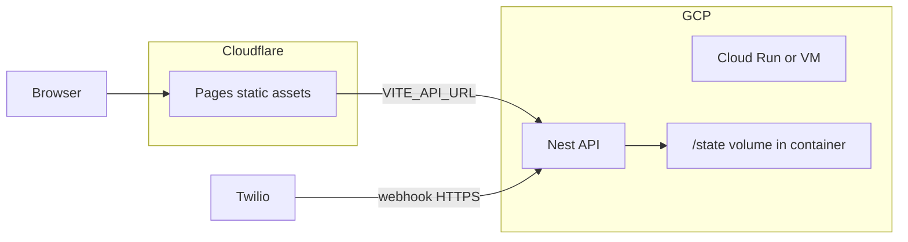

# Deploy: Cloudflare Pages (FE) + Docker on GCP (API)

## Decisions (agreed)

- **Frontend:** Cloudflare **Pages** — static `web` build only; no Workers rewrite.
- **Backend:** **Docker image** running the existing **NestJS** API; deploy to **GCP** (see below).
- **State:** Keep the current **file-based** layout under a **`/state` directory inside the container** (same shape as repo `state/`). Ephemeral is acceptable for this demo (redeploy / new instance = empty or image-baked seed). **No R2** for now.

## Architecture

**GCP target:** **Cloud Run** is the usual fit for one container + HTTP + env vars + public URL. A **Compute Engine VM** with Docker also works if you prefer a long-lived VM and a single open port.

## Frontend (Cloudflare Pages)

1. Build: `cd web && npm ci && npm run build` → output `web/dist`.
2. Pages project: connect repo or upload `dist`; set **root** to build output.
3. **Environment (build-time):** `VITE_API_URL=https://<your-gcp-api-host>` (no trailing slash path issues if client uses it as `baseURL`).
4. Custom domain optional (Cloudflare DNS).

## Backend (Docker)

**Image responsibilities:**

- Base: Node 20 LTS (or match `api/package.json` engines if present).
- **Working directory:** e.g. `/app`, copy `api/` and run `npm ci --omit=dev` + `npm run build` (or multi-stage: builder + slim runtime).
- **STATE_ROOT:** Set to a path **inside** the image filesystem, e.g. `STATE_ROOT=/app/state`.
- **Create empty dirs at build or startup:** `chats`, `bookings` under `/app/state` (Nest `StateService` already `mkdir` on init — confirm `stateRoot` exists or let `onModuleInit` create parents).
- **Port:** `EXPOSE 3000`, `ENV PORT=3000`.
- **CMD:** `node dist/main.js` (or `npm run start:prod` per Nest output).

**Optional:** `COPY state/` from repo if you want **seed** `services.json` / empty `.gitkeep` structure; otherwise empty `/app/state` and let first requests create files.

**Secrets (runtime env on GCP, not in image):** `OPENAI_API_KEY`, `TWILIO_*`, `JWT_SECRET`, `ADMIN_*`, `MCP_API_KEY`, `BOOKING_TIMEZONE`, etc. — same as [`.env.example`](../../.env.example) / `api` config.

## GCP deployment notes

- **Cloud Run:** Deploy image to Artifact Registry; service with min instances 0 or 1; set env vars; allow unauthenticated HTTP if Twilio + browser must reach it (or use IAM + Twilio only if you add auth — current webhook is public with signature guard).
- **Public URL:** Set `TWILIO_WEBHOOK_BASE_URL` to `https://<run-url>` **without** path (code appends `/webhook/whatsapp`).
- **State persistence:** For a **demo**, in-container disk is enough; for **surviving** restarts without external DB, attach a **Cloud Run volume** (if available in your region) or use a **persistent disk on VM** — out of scope unless you upgrade later.

## MCP (`mcp/server.mjs`)

- Still a **local/sidecar Node** process: `API_URL=https://<gcp-host>`, `MCP_API_KEY=...`.
- Not part of Cloudflare or Docker image unless you add a separate optional Dockerfile later.

## Checklist before go-live

- [ ] API health: `GET /` or Swagger at `/docs` from public URL.
- [ ] Twilio sandbox/production: webhook `POST .../webhook/whatsapp` returns 200; signature valid (`TWILIO_WEBHOOK_BASE_URL` matches public origin).
- [ ] Pages `VITE_API_URL` matches API URL; CORS already `origin: true` in [`main.ts`](../../api/src/main.ts).
- [ ] Demo disclaimer: data loss on redeploy is expected with in-container state only.

## Next implementation step (when you approve execution)

Add a **`Dockerfile` under `api/`** (or repo root) implementing the above, plus a short **`docker-compose.yml`** optional for local parity, and document build/push/run commands for GCP in a single section (no need to automate Terraform unless requested).
